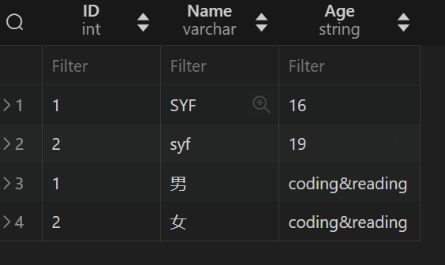

# MySQL

MySQL由Server端和存储引擎俩部分组成


## 连接MySQL服务器

```bash
### 从终端登录MySQL命令行
mysql -u root -h localhost -P 3306 -p #默认端口3306
mysql -u root -p #简写
```

- `mysql`：MySQL 命令行客户端的启动命令。

- `-u root`：指定用 `root` 这个用户名来连接数据库。

- `-h localhost`：指定连接的主机名为 `localhost`，也就是本地服务器。

- `-P 3306`：指定使用的端口号为 `3306`，这是 MySQL 的默认端口号。 **大写**

- `-p`：提示用户输入密码。你在运行这条命令后，会被要求输入与 `root` 用户名对应的密码。

  **MySQL本身是数据库管理的服务器，我们作为客户端登录，对数据库进行操作。**

  **MySQL最大支持的客户端连接数：151**

  **所有连接是**MySQL提供，而非我们创建

  **连接池**：一个连接，**可以**连接上多个数据库；但一次**只能**连上一个数据库

## 数据库结构--表关系

**MySQL数据库是关系型数据库**：数据库中的数据，**以表的形式存在**;多个表之间，**存在关系**（4种关系：1对1，多对1&1对多，多对多）

### 一对一


### 一对多&多对一


### 多对多


**中间表的创建规则：**
1、表名由多对多关系的两个表名称组成。
2、表中只有两个字段，分别建立外键关联到对应表的主键。
3、两个字段都是主键，组成联合主键。

## 命令：数据库操作

**MySQL命令：不区分大小写**

```mysql
# 查看数据库
show databases;
# 创建新的数据库db_name
create database db_name;
# 连接指定数据库
use db_name;
# 查看数据库中的表
show tables; #必须先执行use db01;
# 删除数据库
drop database db_name;
- 分号; 请不要忘记
```


## 表结构

数据表，由不同字段组成；字段由：不同类型的数据和一些约束条件构成

### 数据类型&约束条件

#### 数据类型

常用为以下三种类型（具体：请看使用手册https://mysql.net.cn/doc/refman/8.0/en/data-types.html）

- 数值型：


图片中，浮点数为：非精确值；精确浮点数DECIMAL

- 日期和时间类型：


- 字符串类型：


#### 约束条件

常用约束条件有以下这些

- **UNSIGNED** ：无符号，**值从0开始，无负数**
- **ZEROFILL**：零填充，当数据的显示长度不够的时候可以使**用前补0的效果填充至指定长度**,字段会自动添加UNSIGNED
- **NOT NULL**：非空约束，表示该字段的**值不能为空**
- **DEFAULT**：表示如果插入数据时没有给该字段赋值，那么就使用默认值
- **PRIMARY KEY**：主键约束，表示唯一标识，不能为空，且一个表只能有一个主键。一般都是用来约束id
- **AUTO_INCREMENT**：自增长，只能用于数值列，而且配合索引使用,默认起始值从1开始，每次增长1

- **UNIQUE KEY**：唯一值，表示该字段下的值不能重复，null除外。

  比如身份证号是一人一号的，一般都会用这个进行约束

  PRIMARY KEY 由 NOT NULL 和 UNIQUE KEY

- **FOREIGN KEY**：外键约束，目的是为了保证数据的完成性和唯一性，以及**实现多表：1对1或1对多关系**

- **INDEX**（别名**KEY**）:索引，常用分为：一般索引，唯一索引，主键索引，全文索引，组合索引，空间索引


## 命令：表结构操作 

#### 1创建表

**创建单独的表**

```mysql
-- 创建表
CREATE TABLE users (
    id INT AUTO_INCREMENT PRIMARY KEY, -- 用户ID，自增，主键
    username VARCHAR(50) NOT NULL,     -- 用户名，长度最大为50，不允许为空
    email VARCHAR(100) NOT NULL,       -- 邮箱，长度最大为100，不允许为空
    password VARCHAR(255) NOT NULL,    -- 密码，长度最大为255，不允许为空
    created_at TIMESTAMP DEFAULT CURRENT_TIMESTAMP -- 创建时间，默认当前时间
);
```

**创建包含外键约束的多个表**

**一对多关系：**

```mysql
-- 创建 categories 表
CREATE TABLE categories (
    id INT AUTO_INCREMENT PRIMARY KEY, -- 分类ID，自增，主键
    name VARCHAR(50) NOT NULL          -- 分类名称，长度最大为50，不允许为空
);

-- 创建 products 表，并添加外键约束
CREATE TABLE products (
    id INT AUTO_INCREMENT PRIMARY KEY, -- 产品ID，自增，主键
    name VARCHAR(100) NOT NULL,        -- 产品名称，长度最大为100，不允许为空
    price DECIMAL(10, 2) NOT NULL,     -- 价格，精度为10，小数点后2位，不允许为空
    category_id INT,                   -- 分类ID，外键
    created_at TIMESTAMP DEFAULT CURRENT_TIMESTAMP, -- 创建时间，默认当前时间
    FOREIGN KEY (category_id) REFERENCES categories(id) -- 外键约束
);
```

对于一对多关系，**多对应的表设置外键约束**：如公司和员工

**一对一关系：**

```mysql
CREATE TABLE user (
    id INT PRIMARY KEY,
    name VARCHAR(255),
   # user_detail_id INT UNIQUE,
   # FOREIGN KEY (user_detail_id) REFERENCES user_detail(id)
);

CREATE TABLE user_detail (
    id INT PRIMARY KEY,
    address VARCHAR(255),
    user_id INT UNIQUE,
    FOREIGN KEY (user_id) REFERENCES user(id)
);
```

对于一对一关系，怎么设置外键约束，看需求：

​	通常选择在一方设置外键（看约束），同时添加 `UNIQUE` 约束来确保一对一关系。

​	如果需要更强的约束，可以在双方表中互相设置外键。

**约束条件:**

- 设置默认值：`DEFAULT 值` 
- 非空：`NOT NULL`
- 自动递增：`AUTO_INCREMENT`
- 设置唯一约束：`定义字段 UNIQUE`;补充

- 主键：`PRIMARY KEY`

  默认表名对应的ID

- 外键：`FOREIGN KEY (category_id) REFERENCES categories(id)`

  

  

#### 2查看并修改表结构

```mysql
-- 1查看表
DESC 表名;

-- 2修改字段 
-- 2.1 添加字段：ADD
ALTER TABLE 表名 ADD (COLUMN) 字段名 字段类型;
-- 2.2 修改表字段：MODIFY/ALTER
# ALTER 修改：单独修改属性，不会影响列的其他属性。
ALTER TABLE 表名 ALTER (COLUMN) age DROP/SET DEFAULT;
# MODIFY 修改：需要重新声明约束条件，否则会重置
ALTER TABLE 表名 MODIFY 字段名 定义;
-- 2.3 修改字段名:RENAME COLUMN：
#修改字段名，旧外键约束不会改名；需要手动：删除旧命令，添加新命令
ALTER TABLE 表名 RENAME COLUMN 字段名 TO 新字段名;
ALTER TABLE 表名 CHANGE 字段名 新字段名 新的定义; #需要重新声明,即MODIFY+RENAME组合
-- 2.4 修改表名：RENAME
ALTER TABLE 表名 RENAME TO 新表名
-- 2.5 删除字段/外键约束：DROP 区分：删除约束条件（属于修改表字段）
ALTER TABLE 表名 DROP （COLUMN） 字段名; 

-- 3删除表
DROP TABLE 表名;
```

**命令的逻辑顺序：表结构-->字段结构/外键约束-->数据类型/字段约束条件**

关于修改约束条件

```mysql
-- 重定义：MODIFY
ALTER TABLE 表名 MODIFY (COLUMN) 字段名 字段类型 ...;
-- 添加/修改指定约束 ：ALTER
ALTER TABLE 表名 ADD  PRIMARY KEY (字段名) ; -- 添加主键
ALTER TABLE 表名 ADD  UNIQUE INDEX 索引名(字段) ; -- 添加唯一索引
-- 删除指定约束
ALTR TABLE 表名 DROP PRIMARY KEY; -- 删除表中建立的主键(一般一个表一个主键id) 
ALTER TABLE users DROP INDEX unique_email; -- 删除表中指定的唯一索引 
```


**案例：一对一关系**

```mysql
#1 创建user_details表：注意EXISTS拼写；除最后一行，每行的`,`；每行命令`;`划分
CREATE TABLE IF NOT EXISTS user_details(
    ID int PRIMARY KEY AUTO_INCREMENT,
    Gender varchar(1) DEFAULT "男",
    Hobbies char(50)
);
CREATE TABLE IF NOT EXISTS user(
    ID int PRIMARY KEY AUTO_INCREMENT,
    Name char(8) NOT NULL DEFAULT "",
    Age int ,
    d_ID int UNIQUE,
    FOREIGN KEY (d_ID) REFERENCES user_details(ID)
);
#2 修改表中列结构：
#2.1 ADD 给 user_details 表，添加 user_ID 并设置UNIQUE
ALTER TABLE user_details ADD user_ID int UNIQUE;

#2.2 ALTER DROP 删除 user表 Name默认值的约束
ALTER TABLE user ALTER Name DROP  DEFAULT;

#2.3 ALTER ADD 给user_details创建外键约束，形成严格的一对一关系
ALTER TABLE user_details ADD FOREIGN KEY (user_ID) REFERENCES user(ID);

#2.4 修改user表的d_ID,为details_ID：
#MySQL 不会自动更新外键约束中的列名，因此你需要手动：删除旧约束，添加新约束
ALTER TABLE user RENAME COLUMN d_ID TO details_ID;
# 查找外键约束的id
SELECT CONSTRAINT_NAME 
FROM information_schema.KEY_COLUMN_USAGE 
WHERE TABLE_NAME = 'user' AND COLUMN_NAME = 'details_ID';#运行位置：修改表名前：用d_ID; 修改表名后：用details_ID
#   查询到的第一行，是旧字段名
#删除旧外键约束
ALTER TABLE user DROP FOREIGN KEY user_ibfk_1; # user_ibfk_1为查询到的外键约束id；（MySQL默认给我们的id）
#添加新外键约束
ALTER TABLE user ADD FOREIGN KEY (details_ID) REFERENCES user_details(ID);

-- 认真阅读的读者，会发现，我在俩个表，分别都设计了外键彼此约束；实现：双向外键约束
#实际在生产中，设计一个即可。详见：操作表数据部分：外键约束
```


## 导入与导出数据表

**MySQL导入数据表：**MySQL导入数据，本质就是运行SQL文件；**MySQL高版本的SQL无法适配低版本的SQL**：如果使用的是MySQL57，为了日常使用，**请调换成MySQL80版本**

### 命令：导入与导出

```MySQL
# 导入：mysql
mysql -u username -p database_name < /path/to/imported_file.sql
# 导出：mysqldump
#导出单个表：结构+数据
mysqldump -u username -p database_name table_name > /path/to/exported_file.sql
#导出表结构，不导出数据
mysqldump -u username -p --no-data database_name table_name > /path/to/exported_file.sql
#导出数据，不导出表
mysqldump -u username -p --no-create-info database_name table_name > /path/to/exported_file.sql
#导出整个数据库
mysqldump -u username -p database_name > /path/to/exported_file.sql
#导出所有数据库
mysqldump -u username -p --all-databases > /path/to/exported_file.sql
```

### Navicat导入


**右键数据库，点击运行SQL文件**


**在每个运行中，运行多个查询：**

勾选：Navicat会将SQL文件的语句，按照事务处理，批量执行；因为原子性，只要有一个操作失败，整个事务就会回滚到原状态。

不勾选：逐个执行SQL语句，即使遇到失败，之前操作的数据，也会保存在表中

**一般不勾选，确保导入成功率高；**如果失败，请参考https://blog.51cto.com/u_16099264/11739257

### Navicat导出


结构和数据：得到表结构及表内数据；仅结构：只获得表结构。


## 命令：操作表数据

对于表中数据的操作，即对数据项的操作，分为：

- 添加数据项:Create
- 更新数据项的字段值:Update
- 删除数据项:Delete
- 查询要求的数据项:Read

### **CUD:**

```mysql
-- 1插入 
INSERT INTO table_name(字段名...) VALUES (值...);
#字段名省略，则全部都需赋值
INSERT INTO table_name VALUES(值...);
-- 2更新
UPDATE table_name SET 字段=新的值 WHERE ...;
-- 3删除
DELETE FROM 表名 WHERE ...;
# 更新/删除，必须WHERE限定；否则默认全部数据
```

当我**插入数据时**，**需要遵守：字段的约束条件**：NOT NULL，UNIQUE，PRIMARY KEY 都很好理解

但：**外键约束**，经常被人们遗忘


#### 外键约束--表关系:

```mysql
# 外键约束
FOREIGN KEY 表1.外键字段 REFERENCES 表2(指定字段);
# 这意味着，表1.外键字段 要与 表2.指定字段 绑定；也就是表1插入数据时，表2.指定字段 一定有符合 表1.外键字段的值
```

**子表：**有外键字段及外键约束的表，称之为子表

**父表：**子表外键字段，对应的表，称之为父表

**对于外键字段，插入数据**：**先插入父表，才能插入子表;且子表中外键字段的值，父表必须有。**

**这样的约束：先有父、才有子，就是外键约束**

*此时，回看表关系部分，相信大家，已经有了不同的理解。*


#### 双向外键约束机制：

聪明的学习者，已经发现：如果俩个表，都有外键彼此约束时：**插入/删除，逻辑会出现问题。**

经过实际测试：**插入数据，按最后执行的外键约束的顺序，进行插入；删除/更新，无法正常进行**

故生产中，实现一对一关系，只需设计一个外键即可。


### **R:**

#### 无要求：所有数据项

```mysql
# 查看表中所有数据
SELECT * FROM 表名;
# 查看规定列的数据：形成一个匿名表
SELECT 字段... FROM 表名;
```

#### 有要求：部分数据项

精确查询：

```mysql
-- 精确查询
# WHERE -- AND IN BETWEEN NOT 
# AND
SELECT * FROM 表名 WHERE id>0 AND id <5;
# AND 限定：一定范围的线集，可用BETWEEN AND替代
SELECT * FROM 表名 WHERE ID BETWEEN 1 AND 4;

# OR
SELECT * FROM 表名 WHERE id=1 OR id=2;
# OR 限定：取规定值的点集时，可用IN替代
SELECT * FROM 表名 WHERE id IN(1,2);

# NOT 
SELECT * FROM 表名 WHERE NOT id=1;
SELECT * FROM 表名 WHERE id NOT IN(1,2);
SELECT * FROM 表名 WHERE id NOT BETWEEN 1 AND 5;

# 如何查询NULL
SELECT * FROM 表名 WHERE 字段 IS NULL;
```

模糊查询：

```mysql
-- 模糊查询
# WHERE--LIKE通配符查询，速度慢，自行了解；
# '%'可以匹配任意个字符 '_'只匹配单个字符
SELECT * FROM 表名 WHERE Name = '%F'; # 以F为末尾的值
SELECT * FROm 表名 WHERE Name ='%Y%'; #有Y的值
```


```mysql
-- 模糊查询
# WHERE--REGEXP正则表达式，查询语句
# '^a'以a开始 's$'以s终止 'a|b'a或者b '[abc]'abc其中的一个 '[a-z]'a-z任意字符 '.'匹配任意字符 '+'1到多个字符 '*'0到多个字符
SELECT * FROM 表名 WHERE 字段 REGEXP '^a.*s$';#匹配以a开头、以s结尾，任意长度的字符串
SELECT * FROM 表名 WHERE 字段 REGEXP '^J[AO]N';#匹配JON或者JAN

# 字符'.'需要通过'\\.'表示

#NOT
SELECT * FROM 表名 WHERE 字段 NOT 'qq\\.com$'；#匹配不以qq.com 结尾
```


### 创建查询表

我们查询的数据，默认根据：所查字段的顺序，**构成新的表（只是表的形式呈现，而非真表）**。

**在MySQL57及之前：查询的数据以数据块的形式存储，方便二次查询，称为查询缓存；默认禁止，很少用。**

**在MySQL80：查询缓存,已经完全移除。**


如何根据查询，将其创建成新的表：

```mysql
CREATE TABLE 表名 SELECT ...
```

只需:创建表命令+查询语句


### 分组与排序

**我们查询得到的表，以默认顺序排列，如何根据:字段及其值进行分组和排序？**

#### 假分组：

```mysql
-- 分组 GROUP BY
SELECT id,age FROM 表名 WHERE id BETWEEN 1 AND 5 GROUP BY id,age;
#你会发现，查询的数据：GROUP BY id,age，难道分组命令 无用?
#原因在于：分组命令，并不是单独使用的，1）需要结合：聚合函数，来使用；2)需要表关系：一对多
```

#### 聚合函数--HAING：

##### 

**尽管分组中需要使用聚合函数，但聚合函数，不是只为分组服务**

```mysql
# 聚合函数的使用
SELECT MIN(Age) AS min_age FROM user;#查找Age的最小值，并将其作为min_age字段
#HAVING 与 SELECT 区别：
#SELECT只能过渡原生数据，HAVING过渡聚合函数的数据
SELECT MIN(Age) AS min_age FROM user HAVING min_age>18;
```

#### **真分组**

#### **--分组命令的要求：**

```mysql
# 上一句的命令，字段可以用'*'代替吗？
SELECT * FROM 表名 GROUP BY id；# 这行命令只需失败，原因见下
```

MySQL57及以后的版本，默认启用了 `ONLY_FULL_GROUP_BY` 模式：`GROUP BY` 查询中，所有出现在 `SELECT` 列表中的列必须要么出现在 `GROUP BY` 子句中，要么被聚合函数（如 `SUM`、`COUNT`、`AVG` 等）包裹。

这种模式也限定了，分组意义：

**分组意义：本质是字典[id]:age-->集合[age]:bool的转变**

Age不分组，所有Age值为一个结果集。

Age分组，不同Age值分别为一个结果集。

**是否分组：**

分组的选择：**根据实际需求选择。所要的结果，是基于所有值，还是单个值**。

```mysql
-- 非外键字段，一般不分组
SELECT MAX(Age)AS max_age,MIN(Age) AS min_age,COUNT(Age) AS count_age  FROM user HAVING min_age>0;
SELECT MAX(Age)AS max_age,MIN(Age) AS min_age,COUNT(Age) AS count_age  FROM user GROUP BY Age HAVING min_age>0;
# 根据Age字段分组，Age不同结果分别作为结果集，会记录同一个年龄的count，和相同Age的max，min
# 当然也用例外：一对一，子查询

-- 如何在一对多关系，使用？
-- SELECT 外键id，聚合函数 AS 字段名 GROUP BY 外键 HAVING 聚合函数约束 : 实现 真分组
SELECT cust_id, COUNT(*) AS orders FROM orders GROUP BY cust_id HAVING COUNT(*) >= 2;
```

#### ALL&DISTINCT

结果集的数据，重复的数据，有时根据查询需求，只考虑不同的？

```mysql
-- 计算结果集中重复的结果，默认为所有数据 ALL
SELECT COUNT(ALL Age) AS age_count FROM user;
-- 去重，结果只考虑不同的数量 DISTINCT
SELECT COUNT(DISTINCT Age) AS diff_age_count FROM user;
```

#### 子查询

有时候，我们作为字段值的，可能是查询的结果；此时我们需要子查询。

**定义：嵌套在一个查询中的查询语句，被称为子查询。**先执行子查询语句，再执行本查询。

子查询在执行后，作为字段值使用。

```mysql
# 子查询为同一个表
-- 在员工表：查询公司员工数目> 2的员工有哪些
SELECT com_id,Name FROM user WHERE com_id IN (SELECT COUNT(com_id) AS number FROM user GROUP BY com_id HAVING number>2 );
-- 在user表：查找表中Age大于最小年龄的Name与Age
SELECT Name,Age FROM user WHERE Age > (SELECT MIN(Age) AS min_age FROM user);

# 子查询为外键对应的表：仅参考，一般不这么干
-- 查找user表：user.ID=user_details.ID 的 ID和Name
SELECT ID,Name FROM `user` WHERE `ID` IN (SELECT user_ID FROM user_details GROUP BY `user_ID` ) 
```

**当子查询的字段是：外键约束的字段，一般用表连接，替代子查询。**

#### 表连接

在多个表查询时，我们需要使用外键约束，来实现表连接。

**表连接，分为横向扩展：连接，纵向合并：UNION**


##### 组合查询UNION

```mysql
# 查找user表在user_details表有数据的ID Name Age
SELECT * FROM `user` WHERE ID IN (SELECT user_ID FROM user_details GROUP BY `user_ID` ) ;

-- 组合查询UNION：纵向合并
# 伪实现，查找user表在user_details表有数据的所有数据
SELECT * FROM `user` WHERE ID IN (SELECT user_ID FROM user_details GROUP BY `user_ID` ) UNION
SELECT user_ID ,Gender ,Hobbies  FROM user_details WHERE user_ID IN (SELECT ID FROM user GROUP BY ID); #发现user_ID,Gender,Hobbies 被竖向合并，而非横向

```

UNION实现：



##### 连接 JOIN ON

表连接，可以有效解决子查询不是本表时：效率慢，可读性差 的问题。

```mysql
-- 表连接
# 真实现：利用表连接，轻松实现查询所有数据
# WHERE,HAVING 都只能对单个表，进行条件约束
# ON 限制条件: ON 之后的限制条件，可以是多个表字段 
# INNER JOIN ... ON ... : 返回两表中满足ON约束的数据
SELECT  user.`ID`,user.`Name`,user.`Age`,user_details.`Gender`,user_details.`Hobbies` FROM user INNER JOIN user_details on user.`ID` = user_details.`user_ID`;
# LEFT JOIN ... ON ... : 返回左表中所有数据，右表中满足要求的数据
SELECT  user.`ID`,user.`Name`,user.`Age`,user_details.`Gender`,user_details.`Hobbies` FROM user LEFT JOIN user_details on user.`ID` = user_details.`user_ID`;
# RIGHT JOIN ... ON ... : 返回右表所有数据，左表满足要求的数据
SELECT  user.`ID`,user.`Name`,user.`Age`,user_details.`Gender`,user_details.`Hobbies` FROM user RIGHT JOIN user_details on user.`ID` = user_details.`user_ID`;
```

#### 排序

默认排序，并非我们所要的。

如何根据指定字段，进行排序？

在排序后，我们有时无需整表数据，只需要第一个或前几个的数据，怎么实现？

```mysql
-- ORDER BY 指定字段 ASC升序/DESC 降序 
SELECT * FROM user ORDER BY age ASC;
SELECT * FROM user ORDER BY age DESC;

-- 限定前几个数据
# 升序LIMIT 1: min
SELECT * FROM user ORDER BY age Limit 1;
# 降序LIMIT1： max
SELECT * FROM user ORDER BY age DESC Limit 1;

-- 连接和排序
SELECT * FROM user INNER JOIN user_details ON user.`ID`=user_details.`user_ID` ORDER BY Age LIMIT 2;
# 当我们使用连接时，连接后的表，我们才能 WHERE--GROUP BY--HAVING--ORDER BY 

# 综合使用：连接，分组与排序
SELECT user.`ID`,user.`Name`,user.`Age`, AVG(user.`Age`) AS avg_age ,user_details.`Gender`,user_details.`Hobbies` FROM user 
INNER JOIN user_details ON user.`ID`=user_details.`user_ID`
WHERE `Name`='SYF'# 连接后的新表，字段值同select中字段
GROUP BY user.ID #通过user.ID 分组，而ID是主键，则每个数据项都是一个组
ORDER BY Age ; 
```

查询语句的顺序：

JOIN table2 ON ... => WHERE =>GROUP BY => HAVING => ORDER BY =>LIMIT


## 索引 TODO

MySQL作为关系型数据库，查询数据，在单个表和多个之间。

当数据量大时，默认的查询顺序效率慢。

对于查询常用字段，我们可以设置索引，来加快查询速率。

我们常用的索引：

- 一般索引
- 唯一索引
- 主键索引
- 组合索引
- 全文索引
- 空间索引
-  BTREE 和 HASH 索引

```mysql
-- 一般索引
CREATE INDEX 索引名 ON 表名(指定字段);

-- 唯一索引:要求指定字段，值唯一
CREATE UNIQUE INDEX 索引名 ON 表名(指定字段);
# 我们对字段进行UNIQUE唯一约束时，MySQL字段帮我们创建唯一索引

-- 主键索引：MySQL 主键 由 UNIQUE INDEX + NOT NULL 创建
# 即设置主键约束，省略

-- 组合索引：一个索引，指定多个字段；用于多列搜索
CREATE INDEX idx_name_age ON users (name, age);

# 以下还没怎么用过，待之后补充
- 全文索引
- 空间索引
- BTREE 和 HASH 索引
```


## 视图

**视图（View）** 是 MySQL 中的一种虚拟表，它基于查询的结果集定义，**不存储实际数据，而是通过查询动态生成数据**。视图的作用是简化复杂查询、控制数据访问权限，以及提供数据的不同视角。可以把**视图看作是一个存储在数据库中的 SQL 查询**，它本质上是一个查询的“窗口”。

```mysql
-- 创建
CREATE VIEW 视图名 AS SELECT ... 
# 将SELECT查询，存储到视图
-- 查询
SELECT * FROM 视图名;
-- 修改：即修改SQL语句
ALTER VIEW ... AS
SELECT ...;
-- 删除
DROP VIEW ...;
```

